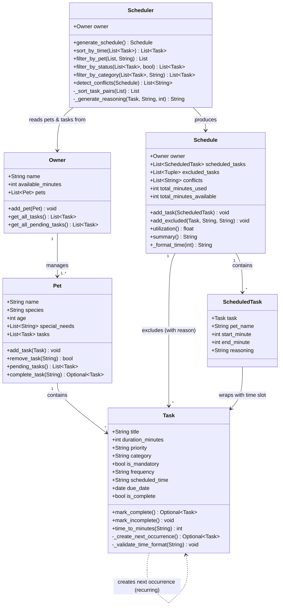

# PawPal+ Final UML Class Diagram

## Changes from Initial UML

1. **Task gained new attributes**: `frequency`, `scheduled_time` (HH:MM), `due_date`, `is_complete` — all added during Phase 3 for recurring tasks and time-based sorting.
2. **Task gained methods**: `mark_complete()` now returns the next occurrence, `_create_next_occurrence()` uses `timedelta`, `time_to_minutes()` for sort key.
3. **Pet gained `complete_task()`**: Handles marking complete + auto-adding the recurring next occurrence.
4. **Pet now holds tasks directly** (composition) — initial UML had tasks passed separately to Scheduler.
5. **Owner now holds pets** and provides `get_all_tasks()` / `get_all_pending_tasks()` — Scheduler retrieves tasks through Owner → Pets chain.
6. **Scheduler gained static methods**: `sort_by_time()`, `filter_by_pet()`, `filter_by_status()`, `filter_by_category()`, `detect_conflicts()`.
7. **Schedule gained `conflicts` list** — populated by `detect_conflicts()` during schedule generation.
8. **ScheduledTask gained `pet_name`** — needed since tasks come from multiple pets.
